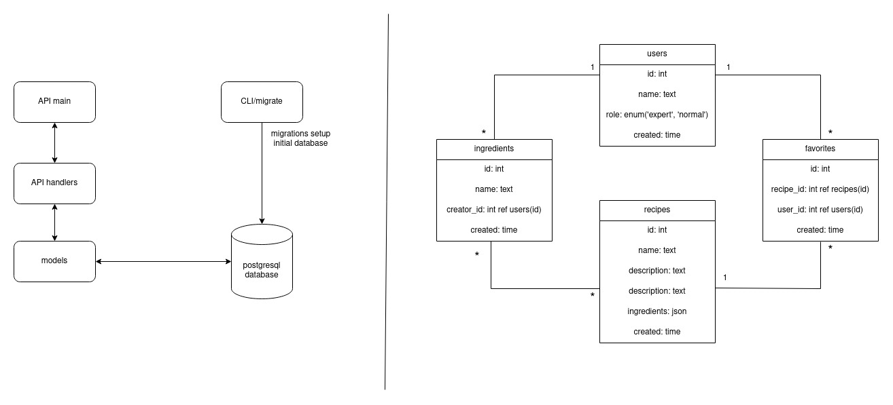

# Welsh Academy

[Version Française](./assets)

**Welsh Academy** is an application dedicated to provide recipes to cheddar lovers around the world. This a backend allowing cheddar **experts** to:

- Create ingredients
- Create recipes of meals using the previously created ingredients

A **user** should be able to enjoy the recipes by using the API to:

- list all existing ingredients
- list all possible recipes (with or without ingredient constraints)
- flag/unflag recipes as his favorite ones
- list his favorite recipes



## Table of contents

- [Tables of endpoints](#table-of-endpoints)
- [Entity/Model design](#entitymodel-design)
  - [User](#user)
  - [Ingredient](#ingredient)
  - [Recipe](#recipe)
  - [Favorite Recipe](#favorite-recipe)
- [API Usage](#api-usage)
  - [/ingredients](#ingredients)
  - [/recipes](#recipes)
  - [/users/:uid/favorites](#usersuidfavorites)
- [Running](#running)
  - [With docker](#with-docker)
  - [Without docker](#without-docker)
- [Testing](#testing)

## Table of endpoints

<table>
    <thead>
        <tr>
            <th>Method</th>
            <th>URL Pattern</th>
            <th>Handler</th>
            <th>Action</th>
        </tr>
    </thead>
    <tbody>
        <tr>
            <td>GET</td>
            <td>/</td>
            <td></td>
            <td>Display a welcome message</td>
        </tr>
        <tr>
            <td>GET</td>
            <td>/ingredients</td>
            <td>listIngredients</td>
            <td>List all existing ingredients</td>
        </tr>
        <tr>
            <td>POST</td>
            <td>/ingredients</td>
            <td>createIngredient</td>
            <td>Create a new ingredient (expert only)</td>
        </tr>
        <tr>
            <td>GET</td>
            <td>/recipes?include=1,2&exclude=3,4</td>
            <td>listRecipes</td>
            <td>List all existing recipes</td>
        </tr>
        <tr>
            <td>POST</td>
            <td>/recipes</td>
            <td>createRecipe</td>
            <td>Create a new recipe (expert only)</td>
        </tr>
        <tr>
            <td>GET</td>
            <td>/users/:uid/favorites</td>
            <td>listFavorites</td>
            <td>List all favorite recipes of an user with id "uid"</td>
        </tr>
        <tr>
            <td>POST</td>
            <td>/users/:uid/favorites</td>
            <td>flagFavoriteRecipe</td>
            <td>Flag/Add a recipe as user favorite one</td>
        </tr>
        <tr>
            <td>DELETE</td>
            <td>/users/:uid/favorites/:fid</td>
            <td>unflagFavoriteRecipe</td>
            <td>Unflag/Remove favorite with id "fid"</td>
        </tr>
    </tbody>
</table>

## Entity/Model Design

### User

User is supposed to be managed by another api, but here I would like to have a simple structure of an user

<table>
    <tbody>
        <tr>
            <td><b>Field</b></td>
            <td>ID</td>
            <td>Username</td>
            <td>Role</td>
        </tr>
        <tr>
            <td><b>Type</b></td>
            <td>Integer</td>
            <td>String</td>
            <td>Expert/User</td>
        </tr>
    </tbody>
</table>

### Ingredient

<table>
    <tbody>
        <tr>
            <td><b>Field</b></td>
            <td>ID</td>
            <td>Name</td>
            <td>CreatorId</td>
            <td>Created</td>
        </tr>
        <tr>
            <td><b>Type</b></td>
            <td>Integer</td>
            <td>String</td>
            <td>Integer</td>
            <td>Time</td>
        </tr>
    </tbody>
</table>

### Recipe

**SubType(RecipeIngredient)**

<table>
    <tbody>
        <tr>
            <td><b>Field</b></td>
            <td>ID(IngredientID)</td>
            <td>Amount</td>
            <td>Unit</td>
        </tr>
        <tr>
            <td><b>Type</b></td>
            <td>Integer</td>
            <td>Float</td>
            <td>String (ml/g/l/kg/...)</td>
        </tr>
    </tbody>
</table>

**Recipe**

<table>
    <tbody>
        <tr>
            <td><b>Field</b></td>
            <td>ID</td>
            <td>CreatorId</td>
            <td>Name</td>
            <td>Ingredients</td>
            <td>Description</td>
            <td>Created</td>
        </tr>
        <tr>
            <td><b>Type</b></td>
            <td>Integer</td>
            <td>Integer</td>
            <td>String</td>
            <td>[]RecipeIngredient</td>
            <td>String</td>
            <td>Created</td>
        </tr>
    </tbody>
</table>

### Favorite Recipe

<table>
    <tbody>
        <tr>
            <td><b>Field</b></td>
            <td>ID</td>
            <td>UserId</td>
            <td>RecipeId</td>
        </tr>
        <tr>
            <td><b>Type</b></td>
            <td>Integer</td>
            <td>Integer</td>
            <td>Integer</td>
        </tr>
    </tbody>
</table>

## API Usage

### **/ingredients**

**GET /ingredients**

**POST /ingredient**
with body

```json
{
  "name": "Tomato",
  "creator_id": 3
}
```

### **/recipes**

**GET /recipes** </br>
**GET /recipes?include=1** </br>
**GET /recipes?include=1,2** </br>
**GET /recipes?exclude=1,2** </br>
**GET /recipes?include=1,3&exclude=2** </br>

**POST /recipes** with body

```json
{
  "name": "Name of recipe",
  "description": "Some details, steps, bla... description",
  "creator_id": 3,
  "ingredients": {
    "1": {
      "amount": 0.5,
      "unit": "bow"
    },
    "2": {
      "amount": 1,
      "unit": "spoon"
    },
    "3": {
      "amount": 100,
      "unit": "g"
    }
  }
}
```

### **/users/:uid/favorites**

**GET /users/1/favorites** </br>
**GET /users/2/favorites** </br>

**POST /users/1/favorites** </br>
with body

```json
{
  "recipe_id": 1
}
```

**DELETE /users/1/favorites/1**

## Running

### **With docker**

We need three environnement variables : POSTGRES_PASSWORD,POSTGRES_DB and PORT.

- POSTGRES_PASSWORD to set password for default postgres user, be default "azerty"
- POSTGRES_DB for the database name, by default "welsh"
- PORT on which the api is exposed, by default 8000

For example:

- POSTGRES_PASSWORD=i-cannot-be-broken
- POSTGRES_DNS=welsh-academy
- PORT=5000

First go to the root project directory

```shell
cd ./path/to/root/of/project
```

With default password and db name:

```shell
docker compose -f ./docker/docker-compose.yml up
```

With custom password, db name and port:

```shell
POSTGRES_PASSWORD=your-password POSTGRES_DB=you-db-name PORT=your-port-number docker compose -f ./docker/docker-compose.yml up
```

And that, api will be available on localhost:8000 (or your port)

### **Without docker**

First run migrations (only for the first time running app)

```shell
go run ./cmd/cli/migrate -dns=your_postgres_dns -up
```

Run the app

```shell
go run ./cmd/api -db-dns=your__postgres_dns -port=your_port
```

## Testing

Test API handlers

```shell
CGO_ENABLED=0 go test ./cmd/api
```

Testing DB models (mock)

```shell
go test ./internal/models/
```
